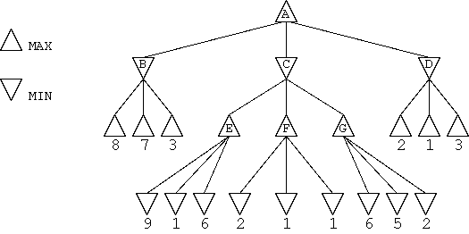

# Übungsblatt: Spiele

## Bonus: Verlässlichkeit von ChatGPT (2P)

Vergleichen Sie Informationen aus zuverlässigen Quellen mit
Informationen aus einem LLM. Beurteilen Sie, ob die vom Model generierte
Information korrekt ist oder ob Dinge fehlen oder Halluzinationen
vorliegen.

Beispiel I: Erstellung einer Zeitleiste eines historischen Ereignisses.

Beispiel II: Erstellen von Quellcode zu einem Standardproblem aus der
Informatik.

*Thema*: Qualität und Zuverlässigkeit von generierten Inhalten

## Games.01: Handsimulation: Minimax und alpha-beta-Pruning (3P)



1.  (1P) Geben Sie für den Spielbaum die Minimax-Bewertungen an.
> - A: 3
>   - B: 3
>   - C: 2
>     - E: 9
>     - F: 2
>     - G: 6
>   - D: 1
2.  (1P) Markieren Sie die Kanten, die bei alpha-beta-Pruning nicht mehr
    untersucht werden würden, d.h. wo Pruning stattfinden würde. Geben
    Sie für jeden Knoten die (sich ändernden) $`\alpha`$- und
    $`\beta`$-Werte an.
> ### Paths to prune
> - ACG (Grund: A = 3, C = 2) → C bleibt gleich $`[\alpha=3,\;\beta=2]`$
> - AD1 (Grund: A = 3, D = 2) → D wird zu 2 statt 1 $`[\alpha=3,\;\beta=2]`$
> - AD3 (Grund: A = 3, D = 2) → D wird zu 2 statt 1 $`[\alpha=3,\;\beta=2]`$
> 
>
| Min / Max | Node | v | $`\alpha`$  | $`\beta`$  | difference  | Pruned |
|-----------|------|---|-------------|------------|-------------|--------|
| Min       | AB   | 3 | $`-\infty`$ | 3          | -$`\infty`$ | Nein   |
| Max       | A    | 3 | 3           | $`\infty`$ | -$`\infty`$ | Nein   |
| Max       | ACE  | 9 | 9           | $`\infty`$ | -$`\infty`$ | Nein   |
| Min       | AC   | 9 | 3           | 9          | -6          | Nein   |
| Max       | ACF  | 2 | 3           | 9          | -6          | Nein   |
| Min       | AC   | 2 | 3           | 2          | 1           | Nein   |
| Max       | ACG  |   |             |            |             | Ja     |
| Min       | AC   | 2 | 3           | 2          | 1           | Nein   |
| Max       | A    | 3 | 3           | $`\infty`$ | -$`\infty`$ | Nein   |
| Min       | AD   | 2 | 3           | 2          | 1           | Nein   |
| Max       | A    | 3 | 3           | $`\infty`$ | -$`\infty`$ | Nein   |

> AD1 und AD3 nicht dargestellt, aber auch gekürzt

3.  (1P) Können die Knoten derart geordnet werden, dass
    alpha-beta-Pruning eine größere Anzahl von Zweigen abschneidet? Wenn
    ja, geben Sie eine solche Ordnung an. Wenn nein, begründen Sie Ihre
    Antwort.

[](https://mermaid.live/edit#pako:eNqVlMtu4yAUQH8F3cWsnMiAA5hF1SZpu-quq8obUq4dS35Eri11Jsq_FxPXnoWTtJZA4tzDBczjCO-1RdCQNeawJ6_bpCLue7g_fuzNATVpm_x0Zjv-PwxIYXZYaJIAT-BbkRcUOSnqgqJG5Wlm8McZ9jzDLLuQno3pLb2g0Em5vtSztB6d0lSdKRZpXuCQYHMltr0SS9lccHYZKb2hTstJf-FifEONJ_UXWcUNVYxq9vNfkK1uqKtJ_dkEhtNPFos7siZ_yMaV4UqsPdxxR3ayr9Sw1Z4_OfLoyvOwxx5a5oilfcWHo-152vO0525nhvPtAxg7hn0AxXDGPc-EQ9mqr9h5kkkFgbuzuQXdNh0GUGJTmr4JRx-Hdo8lJtCvzWJquqJNIKlOrtvBVG91XX73bOou24NOTfHhWt3Bmha3uXEPQjnSBiuLzabuqhY0FVHss4A-widooZZSRaFiTIRURhEL4C9oFrIlpSxWXEZcUXoK4J8fNVyqSHLJQ6E4Z0IyGgDavK2bl_NT5F-k0xckq1-5)

> E wird hier zusätzlich gepruned

*Hinweis*: Reihenfolge der Abarbeitung der Kindknoten: Wie in der VL von
links nach rechts.

*Thema*: Minimax und alpha-beta-Pruning

## Games.02: Optimale Spiele: Minimax und alpha-beta-Pruning (4P)

1.  (2P) Implementieren Sie den Minimax-Algorithmus (wie in der VL
    besprochen) am Beispiel *Tic Tac Toe* in einer Sprache Ihrer Wahl.

2.  (1P) Ergänzen Sie Ihre Implementierung um alpha-beta-Pruning.

3.  (1P) Vergleichen Sie die Anzahl der jeweils berechneten Knoten.
    Überlegen Sie sich dazu ein **sinnvolles** Szenario.

> Siehe [MinMax.ipynb](MinMax.ipynb)

*Thema*: Anwendung Minimax und alpha-beta-Pruning

## Games.03: Minimax vereinfachen (1P)

Vereinfachen Sie den Minimax-Algorithmus aus der Vorlesung, indem Sie
die Eigenschaft *Nullsummenspiel* berücksichtigen und die Funktionen
`Min-Value` und `Max-Value` in eine einzige Funktion ohne explizite
Unterscheidung der Spieler zusammenfassen.

> ```Python
> def minimax(state, player):
>   if Terminal-Test(state): return Utility(state, player)
>   
>   best_v = -inf
>   for move in moves(state, player):
>       v = -minimax(result(state, move), opponent(player))
>       best_v = max(best_v, v)
>
> return best_v 
> ```

Überlegen Sie sich einen Beispielbaum und zeigen Sie anhand dessen die
Bewertung durch den Minimax-Algorithmus und durch Ihren vereinfachten
Algorithmus.

> Die Bewertung und getroffenen Entscheidungen sind identisch zum normalen Minimax

*Thema*: Nullsummenspiel, Minimax

## Games.04: Suchtiefe begrenzen (1P)

Die Verwendung der Suchtiefenbeschränkung erfordert den Einsatz einer
Evaluierungsfunktion.

Betrachten Sie die auf
[https://github.com/aimacode/aima-exercises/blob/master/markdown/5-Adversarial-Search/exercises/ex_9/question.md](https://aimacode.github.io/aima-exercises/game-playing-exercises/ex_9/)
gegebene Evaluierungsfunktion für *Tic-Tac-Toe*.

Geben Sie die Werte der Evaluierungsfunktion für sechs verschiedene
Spielzustände an (3 Endzustände, 3 Zwischenzustände). Begründen Sie,
warum diese Evaluierungsfunktion im Zusammenhang mit *Tic-Tac-Toe*
sinnvoll sein kann.
> ${Eval}(s) = 3X_2(s) + X_1(s) - (3O_2(s) + O_1(s))$
> ```
>  X | O |
> ---+---+---
>  X | O | X    Eval(s) = 3 * 0 + 0 - (3 * 0 + 0) = 0
> ---+---+---
>  O | X | O 
> 
>  X | X |
> ---+---+---
>  X | O | O    Eval(s) = 3 * 1 + 0 - (3 * 2 + 0) = -3 <-- ! result depends on who started
> ---+---+---
>  O | X | O 
> 
>  X | X | O
> ---+---+---
>  O |   | X    Eval(s) = 3 * 0 + 0 - (3 * 0 + 0) = 0
> ---+---+---
>  X | O | O 
> 
>  O | X |
> ---+---+---
>    | O |      Eval(s) = 3 * 1 + 1 - (3 * 0 + 2) = 1
> ---+---+---
>    | X | X 
> 
>  X | X |
> ---+---+---
>  X |   |      Eval(s) = 3 * 1 + 2 - (3 * 1 + 2) = 0 <-- ! result depends on who started
> ---+---+---
>  O |   | O 
> 
>    | X |
> ---+---+---
>  X | O | O    Eval(s) = 3 * 0 + 1 - (3 * 1 + 2) = -4
> ---+---+---
>  O | X | 
> ```
> 
> Die Funktion nutzt ein gewisses Spiel verständnis und ermittelt daran eine Annahme, welche positions muster Vorteilhaft sind
> es berücksichtigt hierbei interessanter, weise nicht welcher Spieler momentan am Zug ist.  
> - 2 Symbole in einer Reihe ohne gegen Symbole sind eine sehr gute Position und werden höher geschätzt als z.B. 2 Reihen mit jeweils einem konkurrenzlosen Symbol.
> - Wird für beide Spieler ermittelt und gegeneinander abgewogen

*Thema*: Suchtiefenbegrenzung und Evaluierungsfunktion

## Games.05: Minimax generalisiert (1P)

Betrachten Sie nun das Problem, den Spielbaum eines Drei-Personen-Spiels
zu evaluieren, das nicht notwendigerweise die Nullsummenbedingung
erfüllt.


Die Spieler heißen 1, 2 und 3. Im Gegensatz zu
Zwei-Personen-Nullsummenspielen liefert die Bewertungsfunktion nun
Tripel $`(x_1, x_2, x_3)`$ zurück, wobei $`x_i`$ der Wert für Spieler
$`i`$ ist. Allianzen zwischen Spielern sind nicht erlaubt.

Vervollständigen Sie den Spielbaum, indem Sie alle inneren Knoten und
den Wurzelknoten mit den entsprechenden Wert-Tripeln annotieren.

[](https://mermaid.live/edit#pako:eNqNlEtPhDAUhf9KcxcuJmUyBVqgC6PO-J7RjSvDpkrHIeEVhEQl_HfbDg5VE5RdT79z77kNbQfPZSKBw0stqh16WMUFUt_pSfe6E5XkqKlTjDLxJDOOYujQbEZmM4Rd7PUx9HGx56_-zWv6eoL29zQZ6ZsJmmmaYHekbyfoQNM-dqzi6wmcatwh3_jNBO-YSamd5u6vNMG36vd_pfExtY_97MBvs7RyfpgIVjZX26yzX05aHOMxrVy70eqks-u6mvIUNdY9twmGD71H4sImVCP6G7m0EaqmHcKMhA40_KLIcY7RGTpCy-EwjLBSwvkwqhEulHA5TGGEKyVcD6GNcKOE2yGjEdZK2AyJjHCnhHstxAVgdVXSBHhTtxJDLutc6CV0Zh-ancxlDHqCRG5FmzUxxEWvbJUoHssy_3LWZfuyA74V2atatVUiGrlKhbqH-UGtZZHIelm2RQPc9wg1VYB38Abc9eYRYUHohdQNKY0iDO_AyYLNA-aFLAo8n4UBcXsMH6bvYh7RwPeJF0aULVgUqXIySZuy3uzfAPMU9J-fXh8O)

*Thema*: Minimax generalisiert für mehrere Spieler
