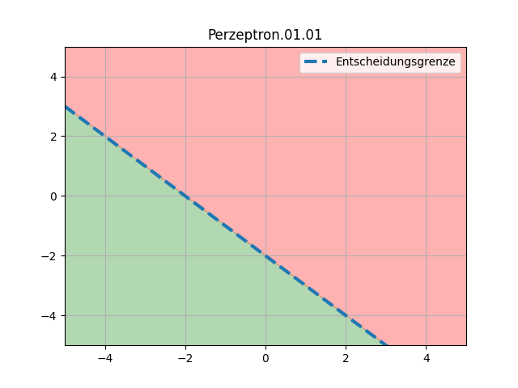
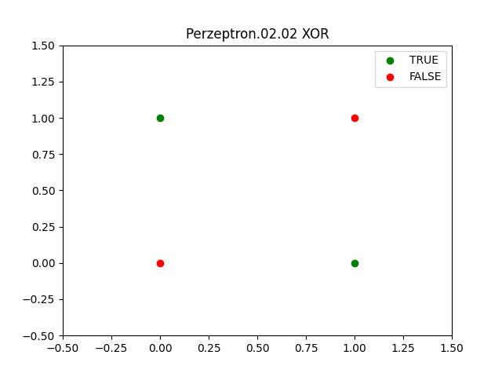
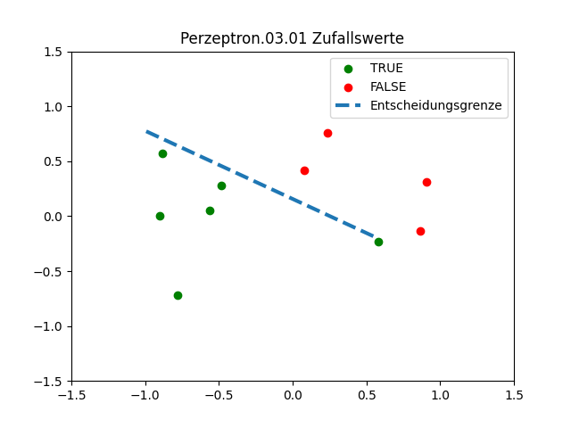

# Übungsblatt: Perzeptron

## NN.Perzeptron.01: Entscheidungsgrenze (2P)

- (1P) Betrachten Sie das durch den Gewichtsvektor
  $`(w_0,w_1,w_2)^T = (2,1,1)^T`$ gegebene Perzeptron. Zeichnen Sie die
  Trennebene und markieren Sie den Bereich, der mit $`+1`$ klassifiziert
  wird.

> 

- (1P) Welche der folgenden Perzeptrons haben die selbe Trennebene?
  Welche weisen exakt die gleiche Klassifikation auf?
  1. $`(w_0,w_1,w_2)^T = (1, 0.5, 0.5)^T`$
  2. $`(w_0,w_1,w_2)^T = (200, 100, 100)^T`$
  3. $`(w_0,w_1,w_2)^T = (\sqrt{2}, \sqrt{1}, \sqrt{1})^T`$
  4. $`(w_0,w_1,w_2)^T = (-2, -1, -1)^T`$

> i. und ii. und iii. sind identisch  
> iv. ist rechtwinklig zu i. und ii. und iii.

*Thema*: Verständnis Interpretation Perzeptron
(Trennebene/Entscheidungsgrenze)

## NN.Perzeptron.02: Logische Funktionen als Perzeptron (2P)

- (1.5P) Das Perzeptron kann zur Ausführung zahlreicher logischer
  Funktionen verwendet werden. Implementieren Sie die binären
  Logikfunktionen UND, ODER und KOMPLEMENT und demonstrieren Sie Ihre
  Implementierung in der Übung/im Praktikum.

> ### UND: $`(w_0, w_1, w_2) = (-0.9, 0.5, 0.5)`$
> ### ODER: $`(w_0, w_1, w_2) = (-0.9, 1, 1)`$
> ### KOMPLEMENT / NOT: $`(w_0, w_1) = (0.9, -1)`$

- (0.5P) Eine grundlegende Einschränkung des Perzeptrons besteht darin,
  dass es die EXKLUSIV-ODER-Funktion nicht implementieren kann. Erklären
  Sie den Grund für diese Einschränkung.

> Die Ergebnisse lassen sich nicht linear Klassifizieren  
> 

*Thema*: Verständnis Perzeptron

## NN.Perzeptron.03: Perzeptron Lernalgorithmus (6P)

Ziel dieser Aufgabe ist es, mit Hilfe eines Experiments ein Gefühl für
die Laufzeit des Perzeptron-Lernalgorithmus zu bekommen und eine Art
empirische Approximation zu bestimmen.

### Datensatz (1P)

- Konstruieren Sie Ihren eigenen Datensatz $`\mathcal{D}`$ mit $`m=10`$
  gleichförmig verteilten Zufallspunkten aus dem Bereich
  $`\mathcal{X}=[-1, 1]\times[-1, 1]`$.

> | $`x^{(m)}`$  | x                   | y                     |
> |--------------|---------------------|-----------------------|
> | $`x^{(1)}`$  | -0.901589782527364  | 0.0047553359138630125 |
> | $`x^{(2)}`$  | 0.23480414408445038 | 0.7620084184131708    |
> | $`x^{(3)}`$  | -0.8810756505498272 | 0.5716233454621114    |
> | $`x^{(4)}`$  | 0.5822780505159197  | -0.23404096108949335  |
> | $`x^{(5)}`$  | -0.48224194318477   | 0.28232903736665804   |
> | $`x^{(6)}`$  | -0.7805014064806628 | -0.7213676003726164   |
> | $`x^{(7)}`$  | -0.5644304939678835 | 0.049802334031829876  |
> | $`x^{(8)}`$  | 0.9077723425096069  | 0.30957016551788885   |
> | $`x^{(9)}`$  | 0.07974604845239752 | 0.4169258575705268    |
> | $`x^{(10)}`$ | 0.862727521994497   | -0.13826818093617632  |


- Wählen Sie auf ähnliche Weise zwei zufällige, gleichmäßig verteilte
  Punkte aus dem Bereich $`[-1, 1]\times[-1, 1]`$. Verwenden Sie die
  Gerade, die durch diese zwei Punkte verläuft, als die
  Entscheidungsgrenze Ihrer Zielfunktion $`f`$. Sie können die positiv
  beschriftete Seite beliebig festlegen.

> Punkt1: [-0.9926578718525403, 0.570007979578977], Punkt2: [0.7723616470074421, -0.19701873610789855]  
> $`f(x) = -0.4307x+0.1393`$

- Werten Sie die Zielfunktion für jeden Datenpunkt $`\mathbf{x}^{(j)}`$
  aus, um die entsprechenden Beschriftungen (Ausgangslabel) $`y^{(j)}`$
  zu erhalten.

>| $`x^{(m)}`$  | x                   | y                     | $`y^{(j)}`$ |
>|--------------|---------------------|-----------------------|-------------|
>| $`x^{(1)}`$  | -0.901589782527364  | 0.0047553359138630125 | 1           |
>| $`x^{(2)}`$  | 0.23480414408445038 | 0.7620084184131708    | -1          |
>| $`x^{(3)}`$  | -0.8810756505498272 | 0.5716233454621114    | 1           |
>| $`x^{(4)}`$  | 0.5822780505159197  | -0.23404096108949335  | 1           |
>| $`x^{(5)}`$  | -0.48224194318477   | 0.28232903736665804   | 1           |
>| $`x^{(6)}`$  | -0.7805014064806628 | -0.7213676003726164   | 1           |
>| $`x^{(7)}`$  | -0.5644304939678835 | 0.049802334031829876  | 1           |
>| $`x^{(8)}`$  | 0.9077723425096069  | 0.30957016551788885   | -1          |
>| $`x^{(9)}`$  | 0.07974604845239752 | 0.4169258575705268    | -1          |
>| $`x^{(10)}`$ | 0.862727521994497   | -0.13826818093617632  | -1          |
>
> 

### Training (3P)

Führen Sie nun den Perzeptron-Lernalgorithmus $`1000`$ mal
hintereinander aus. Initialisieren Sie jedes Mal die Gewichte mit $`0`$.
Wählen Sie in jedem Lernschritt einen Punkt $`\mathbf{x}^{(i)}`$
*zufällig* aus der Menge der falsch klassifizierten Punkte und
aktualisieren Sie die Gewichte entsprechend der folgenden Formel:
$$
\mathbf{w}:=\mathbf{w}+\alpha ( y^{(i)} - h(\mathbf{x}^{(i)}) ) \mathbf{x}^{(i)}
$$

Nehmen Sie $`\alpha=1`$ als Lernrate. Halten Sie für jeden Durchlauf
fest, wie viele Schritte der Algorithmus benötigt, um zu der endgültigen
Hypothese $`h^{*}(\mathbf{x})`$ zu konvergieren. Berechnen Sie am Ende
die durchschnittliche Anzahl von benötigten Schritten. In welcher
Größenordnung liegt sie?

```
Iteration: 105
weights: [-1.         -4.29957352  2.73972354]
-----------------------------------------
1.0  !=  1 True
-1.0  !=  -1 True
1.0  !=  1 True
1.0  !=  1 True
1.0  !=  1 True
1.0  !=  1 True
1.0  !=  1 True
-1.0  !=  -1 True
-1.0  !=  -1 True
-1.0  !=  -1 True
misclassified at Index:  []
misclassified 0 entries
-----------------------------------------
```

> [weights_iterations](images/weights_iterations.csv)  
> Average Iterations = 94,49494949

### Experimente (2P)

Wiederholen Sie das obige Experiment mit $`m=100`$ und $`m=1000`$
Datenpunkten, jeweils ein Mal mit den Lernraten $`\alpha=1`$ und
$`\alpha=0.1`$. In welcher Größenordnung liegt die durchschnittliche
Anzahl von benötigten Schritten in diesen Fällen?

Um eine zuverlässigere Schätzung zu erhalten, können Sie dasselbe
Experiment mehrfach mit anderen zufällig generierten Datensätzen
derselben Größe $`m`$ wiederholen und danach den Durchschnitt über alle
Wiederholungen betrachten.

>m = 100  
> Average Iterations = 60,76

> m=1000  
> Average Iterations = 300,4747475

### Visualisierung (optional)

- Halten Sie während des Trainings die Anzahl der falsch klassifizierten
  Punkte fest und veranschaulichen Sie anschließend den Lernprozess mit
  Hilfe eines zweidimensionalen Plots.
- Visualisieren Sie (auf eine geeignete Weise) Meilenstein 2.1, wie sich
  die Entscheidungsrenze während des Trainings verändert.

Sie können das folgende [**Jupyter
Notebook**](files/perzeptron_lernalgorithmus_starter.ipynb) als
Startpunkt benutzen.

Quelle: *Idee nach* Yaser S. Abu-Mostafa, Malik Magdon-Ismail, and
Hsuan-Tien Lin. 2012. Learning From Data. AMLBook.

------------------------------------------------------------------------


Unless otherwise noted, this work is licensed under CC BY-SA 4.0.

<blockquote><p><sup><sub><strong>Last modified:</strong> 5c788e7 (homework: use local files for attachments (Sheet NN), 2025-10-15)<br></sub></sup></p></blockquote>
